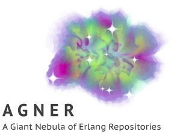

</img>

Agner is a rebar-friendly Erlang package index inspired by Clojars and
Homebrew.

Essentially, Agner is an index of Erlang packages with some extra
capabilities such as versioning, downloads and so on.

Agner is a shorthand for *A Giant Nebula of Erlang Repositories*. It
also pays homage to the Danish statistician Agner Krarup Erlang.

Resources
---------

* [README](https://github.com/agner/agner#readme)
* [CONTRIBUTING](https://github.com/agner/agner/blob/master/CONTRIBUTING.md)
* [Wiki](https://github.com/agner/agner/wiki)

Download
--------

* [Get the source code](https://github.com/agner/agner)

Packages
--------

Please wait a moment while the list of packages is loading.
